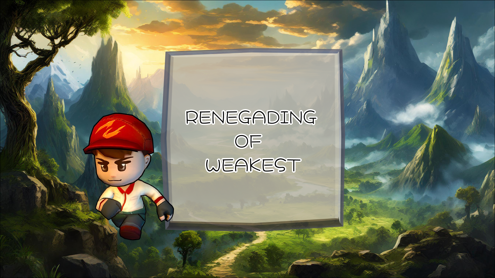

## 背景

・プレイヤーは、攻撃不可。

・モンスターの行動を観察し、ステージを活用しながら撃破を目指します。

・4方向の矢印キーを押している間、その方向にプレイヤーが移動する非常にシンプルな操作スタイル。

・ステージごとに異なるモンスターが登場し、知識を活かした戦略が求められます。

・すべてのモンスターを撃破すれば、ステージクリアとなり、スタート画面に戻ります。

## プレイ
以下のURLからプレイ可能です。
https://hrb213.github.io/RENEGADING-OF-WEAKEST/
